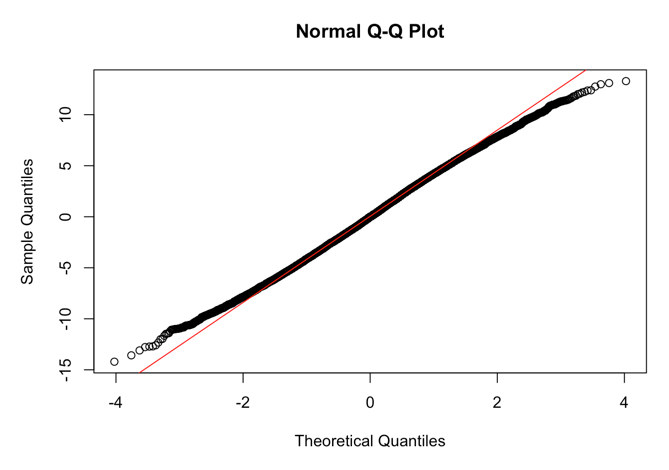
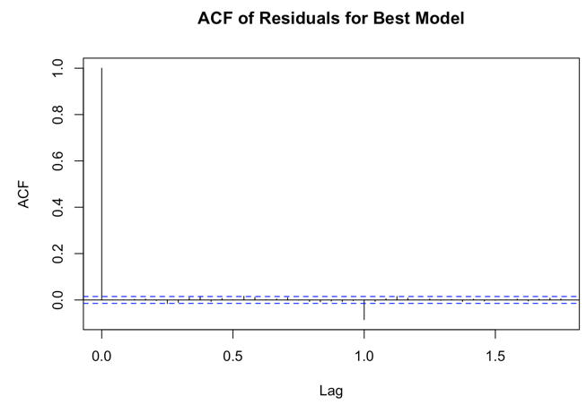
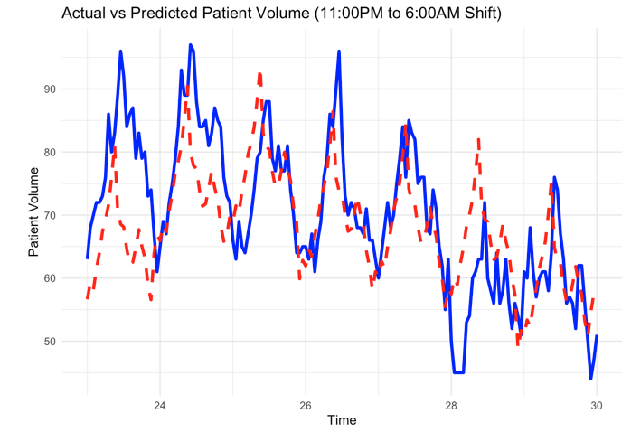
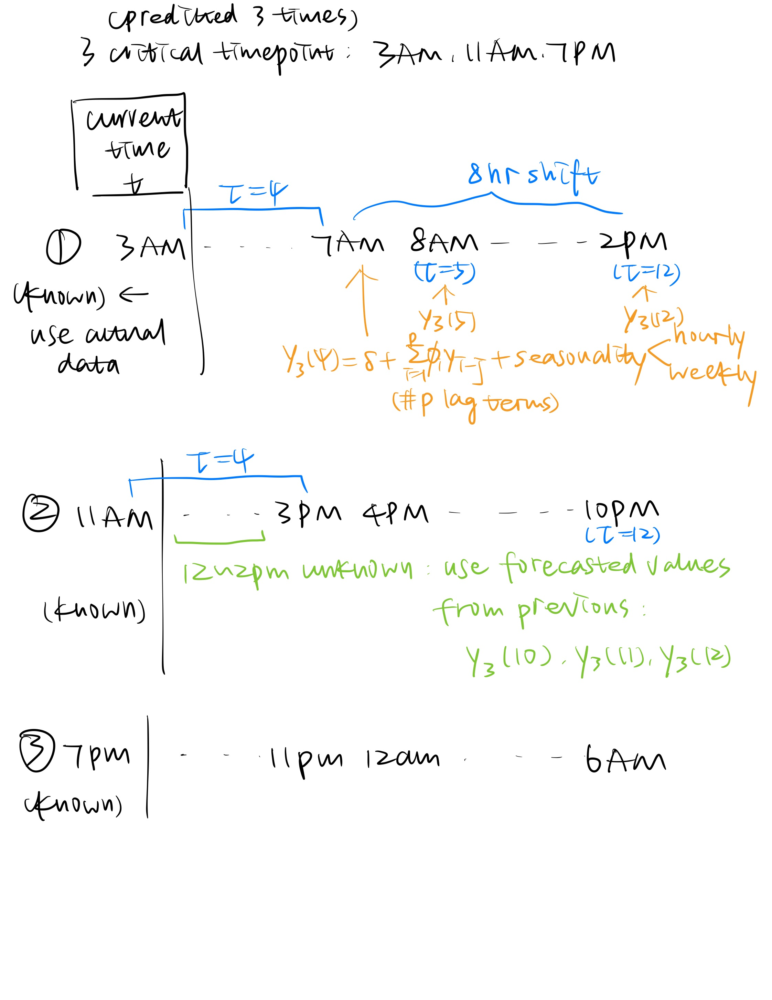

# Time-Series-Forecasting-Patient-Volume-Prediction-System

## Table of Contents
- [Project Description](#project-description)
- [Dataset Overview](#dataset-overview)
- [Models and Results](#models-and-results)
- [Further Improvement](#further-improvement)
- [Contributors](#contributors)

## Project Description
This project involved developing a time-series forecasting model to predict patient volume in a hospital unit, enabling hospital management to make informed resource allocation decisions. The system predicts patient volume 4 hours in advance for three daily shifts (7:00 AM, 3:00 PM, and 11:00 PM) using ARIMA, SARIMA, and LSTM models. Model training was performed on varying timeframes (6 months, 1 year, 18 months, and 2 years) and evaluated using the Mean Absolute Deviation (MAD) metric. The forecasts can be potentially used to help optimize staffing and improve patient care by accurately anticipating demand.

## Dataset Overview
The file [PatientVolume.csv](PatientVolume.csv) contain hourly patient volume in a hospital unit (e.g., Hospital Medicine) at a large hospital.
The dataset contains the following fields:
1. Date - Day of year
2. Weekday - Day of a week (i.e. Sunday-Saturday) as numerics and string
3. Hour - Hour of day as a numerical integer value for each hour
4. Patient Volume - Number of patients in the unit at the given time

## Models and Results
[R code](ForecastingTS.Rmd)

1. Data Cleaning and Preprocessing 
    - Create dummies for weekday (seasonality)
2. Train/Test Split: 
    - 6 month data, 1 year data, 18 month data, and two year data
3. Train ARIMA models using different training periods: `auto.arima`

Breakdown of the logic:

1. **7:00 AM to 2:00 PM Prediction** (at 3:00 AM):
   - **Extract actual values**: The actual values for the 7 AM to 2 PM shift are selected using `window(actual_test_ts, start = 7, end = 14)`.
   - **Set prediction horizon**: The length of the actual shift data is calculated and used as the prediction horizon (`h_pred_7am`).
   - **Forecast using model**: A forecast is made using the previously fitted model (`forecast(model, xreg = ...)`), applying exogenous variables for the same time period from the test set. The result is stored as a time series (`pred_7am_shift`).
   - **Calculate MAD (Mean Absolute Deviation)**: The accuracy of the prediction is evaluated using the MAD metric (`mad_metric`), comparing actual and predicted values.

2. **3:00 PM to 10:00 PM Prediction** (at 11:00 AM):
   - **Extend training data**: The previous prediction for the 7 AM shift is added to the original training data (`extended_train_3pm`).
   - **Refit model**: The ARIMA model is re-fitted with the extended training data and exogenous variables (`model_extended_3pm`).
   - **Extract actual values**: The actual data for the 3 PM to 10 PM shift is extracted similarly (`window(actual_test_ts, start = 15, end = 22)`).
   - **Forecast for 3 PM shift**: A new forecast is made for this shift using the extended model, with updated exogenous variables (`pred_3pm_shift`).
   - **Calculate MAD**: The prediction's accuracy is again evaluated using the MAD metric.

3. **11:00 PM to 6:00 AM Prediction** (at 7:00 PM):
   - **Extend training data further**: Both previous shift predictions are combined with the training data (`extended_train_11pm`).
   - **Refit model**: The ARIMA model is re-fitted again using this further extended dataset (`model_extended_11pm`).
   - **Extract actual values**: The actual values for the 11 PM to 6 AM shift are extracted (`window(actual_test_ts, start = 23, end = 30)`).
   - **Forecast for 11 PM shift**: Another forecast is made for this shift with its corresponding exogenous variables (`pred_11pm_shift`).
   - **Calculate MAD**: The prediction accuracy is calculated using the MAD metric.

4. **Calculate average MAD**:
   - The MAD values for all three shifts are averaged (`avg_mad`), and this average is stored for further evaluation (`mad_values`).

Overall, the code ensures the forecasts are made sequentially for three different shifts, refitting the model with new data and exogenous variables as needed. It also calculates the average prediction error for evaluation.

### **Model Interpretation**

**Autoregressive (AR) Terms**: The coefficients for AR(1), AR(2), AR(3), and AR(4) suggest that the model is using four previous time steps to predict the current value. The largest impact comes from AR(2) with a value of 𝜙2=0.3827.

**Moving Average (MA) Term**: The MA(1) coefficient, 𝜃1=0.4048, represents the influence of the previous error on the current forecast.

**Seasonal Autoregressive (SAR) Terms**: The SAR(1) and SAR(2) terms capture seasonal patterns over a longer period. The negative values for Φ1=−0.6624 and Φ2=−0.3406 indicate that seasonality has an inverse impact over time.

**Day-of-the-Week Regressors**: The weekday dummy variables show the effect of each day of the week on the forecast. For example:

Fridays (WeekDayFri=−8.4507) and Saturdays (WeekDaySat=−15.1009) have a significant negative effect on the predicted values.
Tuesdays (WeekDayTue=3.0089) have a positive effect, while other weekdays (like Wednesday, Thursday, and Sunday) have varying levels of negative effects.

See more details in the [html report](ForecastingTS.html).

## Further Improvement

1. Incorporate Exogenous Variables (ARIMAX): 
- Weather data (e.g., temperature, humidity)
- Holidays or special events
- Staffing levels or schedules

2. Consider non-linear models like SARIMA or TBATS

3. Consider interactions between these terms

4. Use More Advanced Time Series Models Consider more advanced methods such as: Prophet (Facebook): Automatically detects change points in the trend and handles seasonality well. Long Short-Term Memory (LSTM) or Recurrent Neural Networks (RNN): Deep learning models, particularly LSTM, are capable of capturing long-term dependencies in time series data.

## Contributors
- Yumin Zhang
- Xiyi Lin
